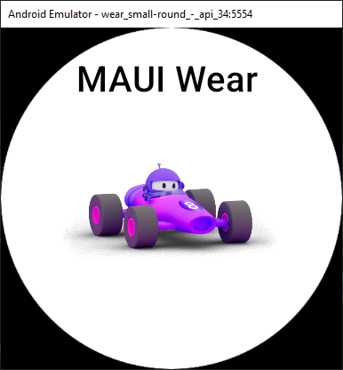

# Learn - Watch WearMaui with .NET MAUI

This repository provides an example on how to crete a Watch app with .NET MAUI and link it to your mobile app.

**Author:** [Damian Suess](https://www.linkedin.com/in/damiansuess/)<br/>
**Website:** [SuessLabs.com](https://suesslabs.com)<br/>
_Submitted with ❤ by Xeno Innovations, Inc. and Suess Labs._



## Project Configuration

The projects disable `ImplicitUsings` so that you can clearly see which libraries and namespaces need to be included for each class.

### Tech Stack

* .NET MAUI v8
* Android Wear API 34

### The Projects

1. Learn.MauiWatch.MobileApp - All-in-one Mobile and Wear apps
   * Status: In-progress
   * Features: Watch to App communication
   * Packages:
     * `Xamarin.GooglePlayServices.Wearable`
2. Learn.MauiWatch.Wearable - Xamarin.Android based Wear app
   * Status: Done
   * Features: UI Only
3. Learn.MauiWatch.WearMaui - .NET MAUI UI exclusive UI
   * Status: Done - UI Only
   * Features: UI Only

### Put Watch into Developer Mode

Place your watch into ***Developer***  mode by performing the following:

1. Go to **System** -> **About Watch** -> **Software Information**
2. Tap the _"Software version"_ section 7 times.

## Recreate Wear MAUI App

For the MAUI Android Wear app, you don't have to do much to get it up and running. Notice, we didn't event need to add to the `AndroidManifest.xml` file, `<uses-feature android:name="android.hardware.type.watch" />`.

To perform communications you can choose between WiFi or Bluetooth. The more common being, Bluetooth for communication between the app and wearable.

### Permissions - AndroidManifest.xml

```xml
  <uses-permission android:name="android.permission.ACCESS_NETWORK_STATE" />
  <uses-permission android:name="android.permission.INTERNET" />
```

## Recreate Mobile App

### Permissions

* `<uses-permission android:name="android.permission.ACCESS_NETWORK_STATE" />`
* `<uses-permission android:name="android.permission.INTERNET" />`

## References

Official Guides:

* [MAUI Wear OS/Watch OS Support](https://github.com/dotnet/maui/discussions/1144)
* [Watch Face](https://github.com/MicrosoftDocs/xamarin-docs/blob/live/docs/android/wear/platform/creating-a-watchface.md)

Around the Internet:

* [Showcase-1](https://www.saboit.de/blog/net-maui-android-watch-application-showcase-part-1) [Showcase-2](https://www.saboit.de/blog/net-maui-android-watch-application-showcase-part-2)
* Dimmer-MAUI [App](https://github.com/YBTopaz8/Dimmer-MAUI) - [Wear](https://github.com/YBTopaz8/DimmerWatchWearMaui)
  * [Parse-LiveQueries](https://github.com/YBTopaz8/Parse-LiveQueries-DOTNET) comms.
* [MAUI with Watch Apps](https://github.com/vouksh/MauiWithWatchApps)
